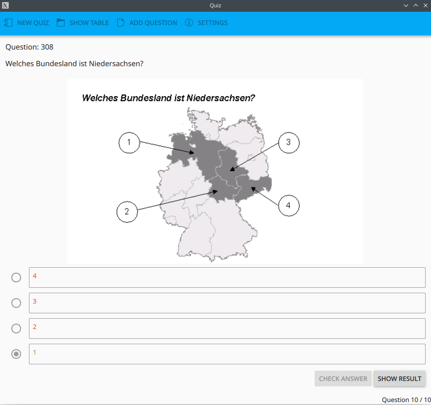
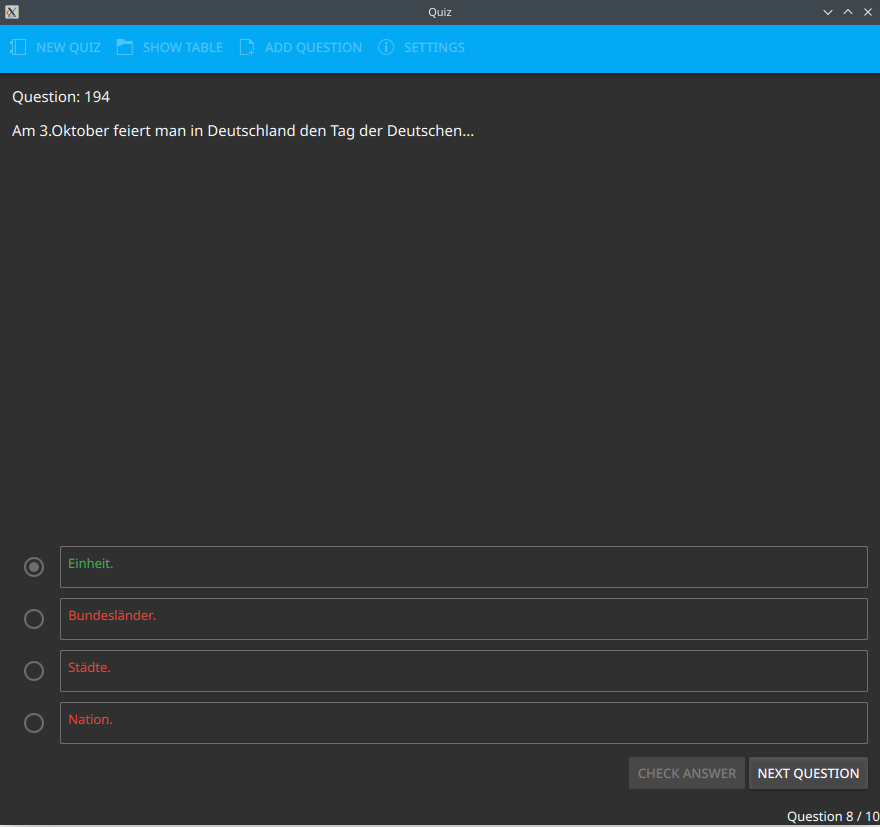
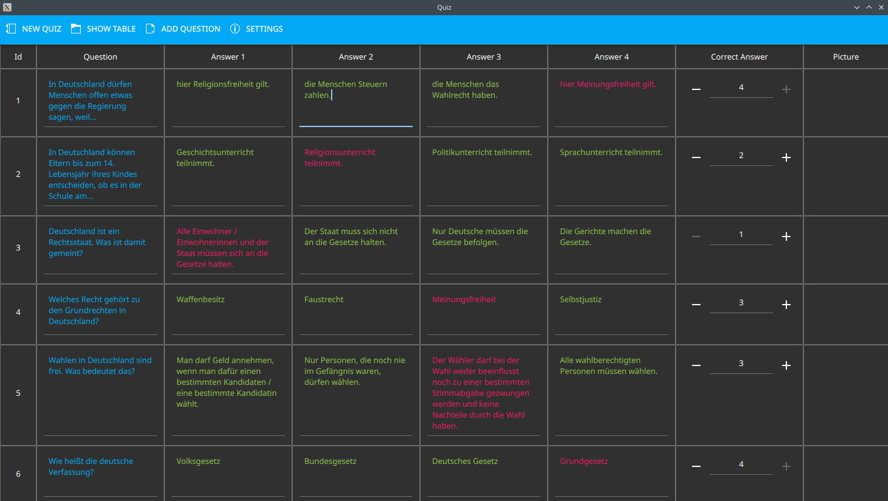
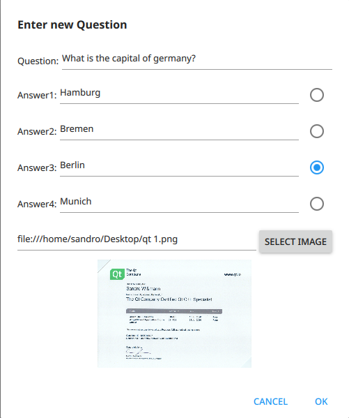
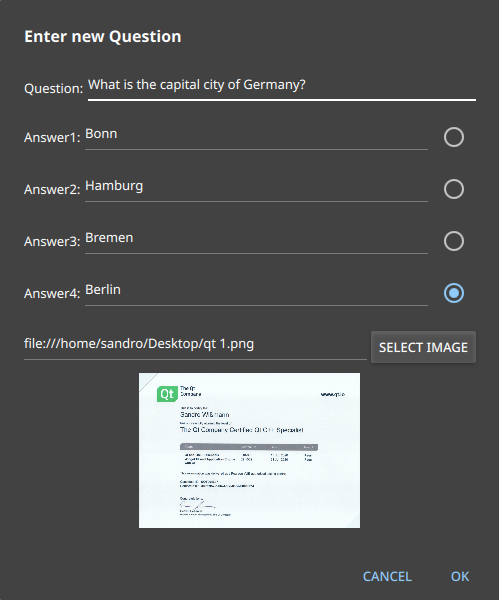
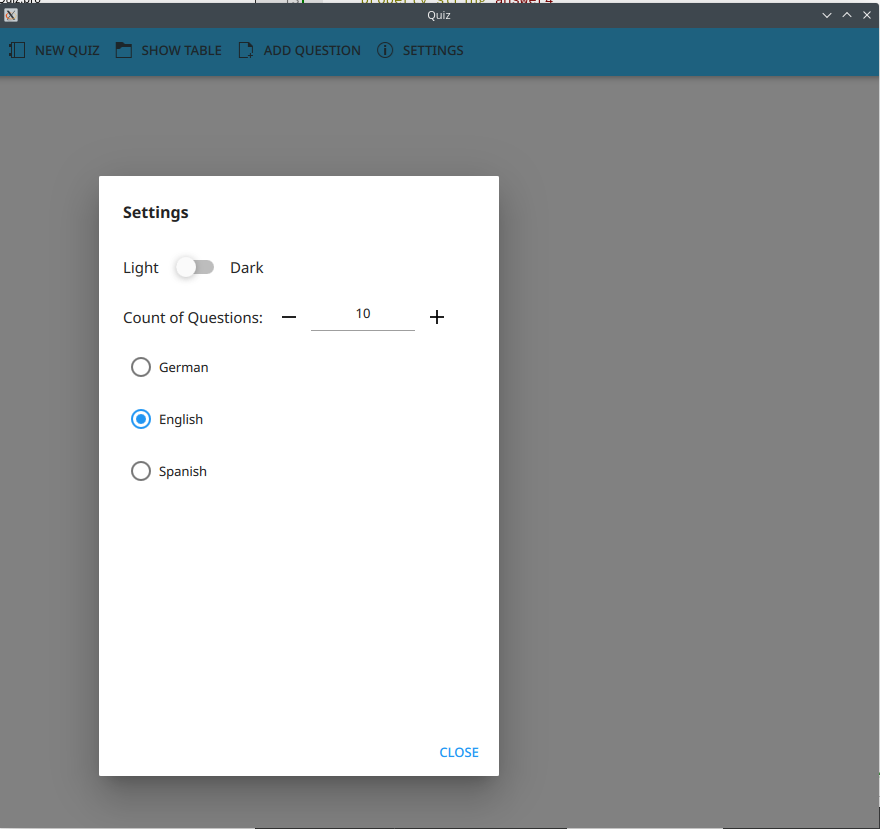
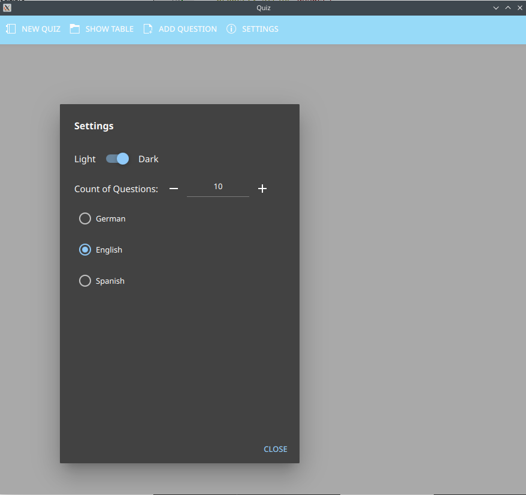
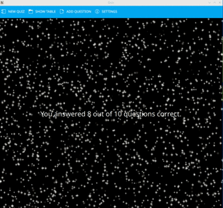

# Quiz
Multiple choice quiz application using C++ with SQLite as backend and QML as frontend

## Features

* Play a multiple choice quiz to practice questions:

<table>
  <tr>
    <td></td>
    <td></td>
  </tr>
 </table>

* View and modify questions from a database:

<table>
  <tr>
    <td></td>
  </tr>
    <tr>
    <td></td>
  </tr>
 </table>

* Add new Questions to the databse:

<table>
  <tr>
    <td></td>
    <td></td>
  </tr>
 </table>

* Modify the app settings
   * Change how many questions per quiz are asked
   * Change appearance between Light and dark mode dynamically
   * Change language to German, English or Spanish dynamically

<table>
  <tr>
    <td></td>
    <td></td>
  </tr>
 </table>

* Different result page displayed depending on how many questions were answered correct:

<table>
  <tr>
    <td></td>
    <td></td>
    <td></td>
  </tr>
  <tr>
    <td></td>
    <td></td>
    <td></td>
  </tr>
    <tr>
    <td></td>
  </tr>
 </table>

## Loading the database

* If you want to try out the app you can copy from the folder `Quiz/databases` the file `quiz.db` to your desktop. Currently the database gets always loaded on startup from the desktop. If there is none a new empy database is created which needs to be filled with questions via the app to play the quiz.

## Dependencies for Running Locally

* QT >= 5.15 
  * You can download QT [here](https://www.qt.io/download). Developed under QT Creator

## License

This project is licensed under the GPL3 License - see the [LICENSE.md](LICENSE.md) file for details