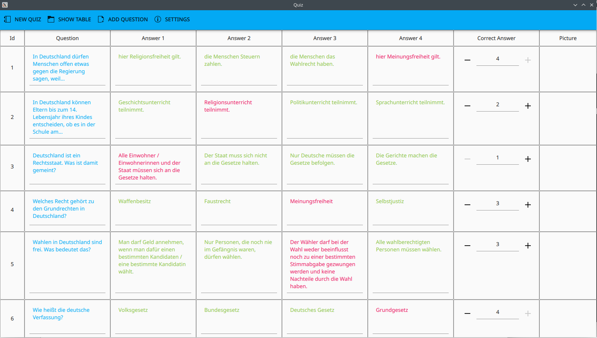
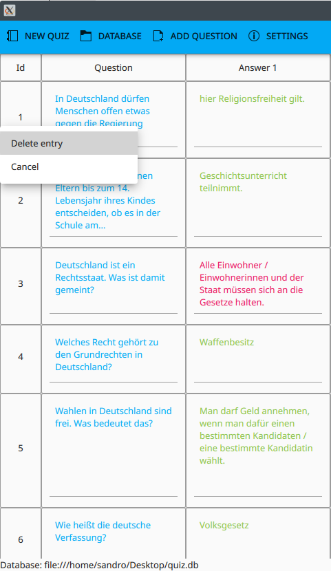
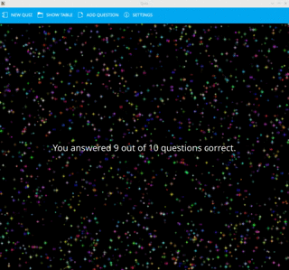
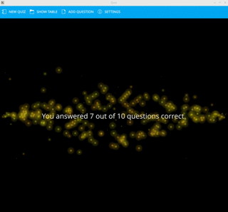
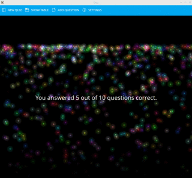
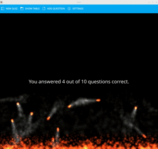

# Quiz
Multiple choice quiz application using C++ with SQLite as backend and QML as frontend

## Features

* Play a multiple choice quiz to practice questions:

<table>
  <tr>
    <td></td>
    <td></td>
  </tr>
 </table>

* Open, close, show and create a database:
<table>
  <tr>
    <td></td>
    <td></td>
  </tr>
 </table>

* View and modify questions from a database:
<table>
  <tr>
    <td></td>
  </tr>
    <tr>
    <td></td>
  </tr>
 </table>

* Add new questions to the database:
<table>
  <tr>
    <td></td>
    <td></td>
  </tr>
 </table>

 * Delete questions from the database (Right click on id field):
<table>
  <tr>
    <td></td>
    <td></td>
  </tr>
 </table>

* Modify the app settings
   * Change how many questions per quiz are asked
   * Change appearance between light and dark mode dynamically
   * Change language to German, English or Spanish dynamically

<table>
  <tr>
    <td></td>
    <td></td>
  </tr>
 </table>

* Different animations displayed depending on how many questions were answered correct:

<table>
  <tr>
    <td></td>
    <td></td>
    <td></td>
  </tr>
  <tr>
    <td></td>
    <td></td>
    <td></td>
  </tr>
    <tr>
    <td></td>
  </tr>
 </table>

## Loading a database

* If you want to try out the app, you can use the file `quiz.db` from the folder `Quiz/databases`.

* You can open this database by choosing `Database->Open existing` in the toolbar.

* Also you can create a new database by choosing `Database->Create new`. 

* Once a database is loaded and if it contains enough questions, a new quiz can be
  started from the `Quiz` button in the toolbar

## Dependencies for Running Locally

* QT >= 5.15 
  * You can download QT [here](https://www.qt.io/download). Developed under QT Creator

## License

This project is licensed under the GPL3 License - see the [LICENSE.md](LICENSE.md) file for details
